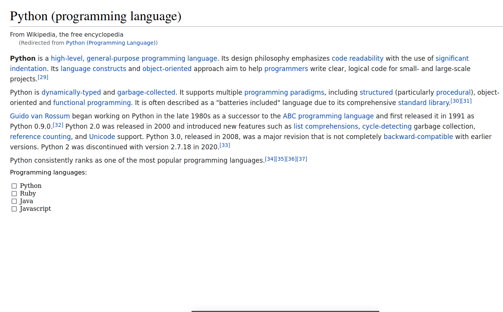
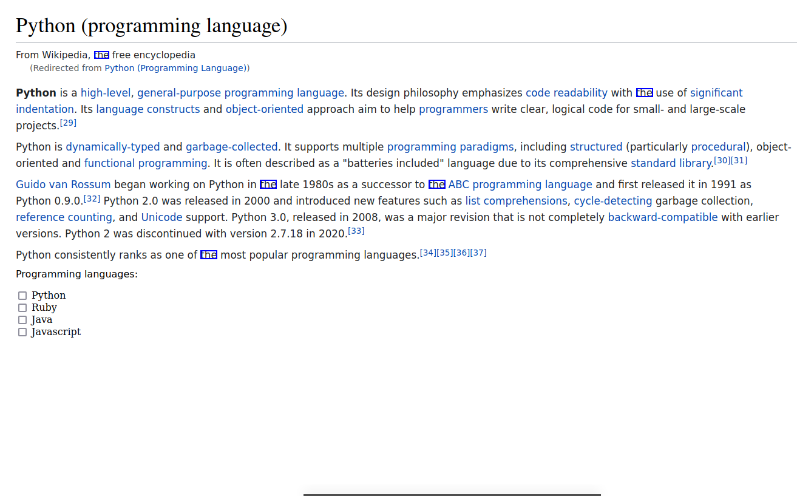

# Bree

A library for automating looking at the screen:

* Use image recognition to find objects on the screen
* Use optical character recognition (OCR) to find or extract text

Bree is like [SikuliX](https://github.com/RaiMan/SikuliX1), except:

1. it doesn't rely on Jython
2. it doesn't provide a friendly IDE for developing scripts
3. it has a different API
4. it doesn't offer tools for moving the mouse or using the keyboard
   ([PyAutoGUI](https://pyautogui.readthedocs.io/en/latest/install.html) is a good choice for that)

Long-term plans are to provide a SikuliX-like API, including the ability to control the mouse and keyboard.

## Installation

1. This package depends on the following, which may have non-Python dependencies that you'll need to install first:
    - [PyAutoGUI](https://pyautogui.readthedocs.io/en/latest/install.html)
    - [Python Tesseract](https://github.com/madmaze/pytesseract#installation)
2. Run `poetry install`

## Usage

### Getting a Screenshot / Image

#### Screenshot

The `Screen` class provides access to the screen.
You can use the `screenshot` method to take a picture of the screen -- it returns an `Image` object (see next section).

```python
from bree.image import Screen

screen = Screen()
current_screenshot = screen.screenshot()
```

The `screenshot` method returns an unchanging image.
In other words, as the screen updates, `current_screenshot` will not change.

However, if you want to use the live screen (i.e. each time a method is called, it uses the latest screenshot), just
call the methods on the `Screen` object directly.

#### Image

The `Image` class provides the ability to load images.  The constructor takes one argument:
1. a string, which is treated as a reference to the file to load
2. a `pathlib.Path` object, which is treated as a reference to the file to load
3. a PIL image
4. a numpy array

```python
from pathlib import Path

import numpy as np
from PIL import Image as PILImage

from bree.image import Image

image_from_file = Image("tests/resources/the.png")
image_from_path = Image(Path("tests/resources/the.png"))
image_from_pil = Image(PILImage.open("tests/resources/the.png"))
iamge_from_numpy = Image(np.asarray(PILImage.open("tests/resources/the.png")))
```

### Extracting Text (Optical Character Recognition, or OCR)

The `Screen` and `Image` classes provide the ability to extract text using the `get_text` method, e.g.:

```python
from bree.image import Image

wiki_img = Image("tests/resources/wiki-python-text.png")
text = wiki_img.get_text()
print(text[:120])
```

Will output:
```
Python (programming language)


From Wikipedia, the free encyclopedia
(Redirected from Python (Programming Language))

```

See the API docs for how to specify the language and other method parameters.

### Finding Text and Images

The `Screen` and `Image` classes provide the ability to search for text, images, or both using the methods:

* `find_text_all` -- Search for the provided string(s) and return a list of matches
* `find_text` -- Wrapper around `find_text_all` that returns the best match, or `None` if no matches found
* `find_image_all` -- Search for the provided image(s) and return a list of matches
* `find_image` -- Wrapper around `find_image_all` that returns the best match, or `None` if no matches found
* `find_all` -- Returns the combined output of `find_text_all` and `find_image_all`
* `find` -- Returns the result from `find_text` or `find_image`, whichever has a higher confidence of match, or `None`
  if no matches found

All methods can search for a single value or a collection of values.
Only matches above a threshold are returned; configure the threshold using the `confidence` parameter (0 = no
confidence, 1.0 = perfect match).

The text search methods can also search using regular expressions (set the `regex` keyword argument to `True`).

See the API docs for more details on the parameters.

Matches are instances of the `MatchedRegionInImage` class, which inherits from the `RegionInImage` class where most of
the methods are defined.  Properties that might be useful are:

* `region` -- an instance of the `Region` class, the bounding box where the search needle was found
  This might not be very useful if the text starts towards the end of one line and ends around the beginning of another.
* `parent_image` -- a reference to the image that this object is just a region of
* `confidence` -- confidence in the match (0 = no confidence in match, 1.0 = complete confidence in match)
* `needle` -- the search needle the match corresponds to, which is useful when searching for multiple needles at once

Finding "the" in an image:

```python
from pprint import pprint

from bree.image import Image

wiki_img = Image("tests/resources/wiki-python-text.png")
the_img = Image("tests/resources/the.png")

locations_of_the_img = wiki_img.find_image_all(the_img)
locations_of_the_text = wiki_img.find_text_all("the")
pprint(locations_of_the_text)
```

Will output a list that should look like:

```
[MatchedRegionInImage(parent_image=Image(image='tests/resources/wiki-python-text.png'), needle='the', region=Region(x=155, y=84, width=24, height=12), confidence=0.9488720700000001),
 MatchedRegionInImage(parent_image=Image(image='tests/resources/wiki-python-text.png'), needle='the', region=Region(x=1048, y=145, width=27, height=14), confidence=0.9701110799999999),
 MatchedRegionInImage(parent_image=Image(image='tests/resources/wiki-python-text.png'), needle='the', region=Region(x=428, y=296, width=27, height=14), confidence=0.96328171),
 MatchedRegionInImage(parent_image=Image(image='tests/resources/wiki-python-text.png'), needle='the', region=Region(x=706, y=296, width=27, height=14), confidence=0.9653327199999999),
 MatchedRegionInImage(parent_image=Image(image='tests/resources/wiki-python-text.png'), needle='the', region=Region(x=330, y=412, width=27, height=14), confidence=0.96940147)]
```

### Showing the Image and Regions Within

Sometimes you will want to see the image you're working with.
To do so, `Screen` and `Image` provide a `show` method that will open a window to show the image, e.g.:

```python
from bree.image import Image

wiki_img = Image("tests/resources/wiki-python-text.png")
wiki_img.show()
```

Will show the image:



The `show` method offers a keyword-only parameter called `bounding_boxes` that can be used to highlight certain regions
in the image (e.g. the results of one of the find methods mentioned above).  It takes an iterable of `Region` objects.
For example:

```python
from bree.image import Image

wiki_img = Image("tests/resources/wiki-python-text.png")
locations_of_the_text = wiki_img.find_text_all("the")
wiki_img.show(bounding_boxes=locations_of_the_text)
```

Will show the image:



### Regions within the Screen or Image

To select just a region within an image (e.g. a `Screen` or `Image` object), use the `get_child_region` method, which
returns a `RegionInImage` object.

```python
from bree.image import Image
from bree.location import Region

wiki_img = Image("tests/resources/wiki-python-text.png")
print("Complete image dimensions:", wiki_img.region)

bottom_half = wiki_img.get_child_region(Region.from_coordinates(0, wiki_img.height // 2, wiki_img.width, wiki_img.height))
print("Just the bottom half:", bottom_half.region)
```

Will output:

```
Complete image dimensions: Region(x=0, y=0, width=1313, height=817)
Just the bottom half: Region(x=0, y=700, width=1312, height=116)
```

Selecting regions within the screen or an image is perhaps most useful when performing OCR or using the find methods, e.g.:

```python
from bree.image import Image
from bree.location import Region

wiki_img = Image("tests/resources/wiki-python-text.png")
bottom_half = wiki_img.get_child_region(Region.from_coordinates(0, wiki_img.height // 2, wiki_img.width, wiki_img.height))
text = bottom_half.get_text()
print(text[:100])
```

Will output:

```
Python consistently ranks as one of the most popular programming languages.!341[351[361[37]
Programm
```


### Waiting for Images or Text to Appear or Vanish

Methods exist that will wait until an image or text appears or vanishes:

* wait_until_image_appears
* wait_until_text_appears
* wait_until_image_vanishes
* wait_until_text_vanishes

These make the most sense to use on a `Screen` object or a `RegionInImage` that descends from a `Screen` object since
unlike `Image` objects, `Screen` objects can change over time.

An example:

```python
from bree.image import Screen

screen = Screen()
locations_of_the = screen.wait_until_text_appears("the")
```

This will wait up to 5 seconds (you can change this by setting the `timeout` parameter) for "the" to appear somewhere
on the screen.  In addition to being able to set any of the parameters used in `find_text_all`, you can also configure
the time to wait (`timeout`) and how many scans per second (`scans_per_second`).
